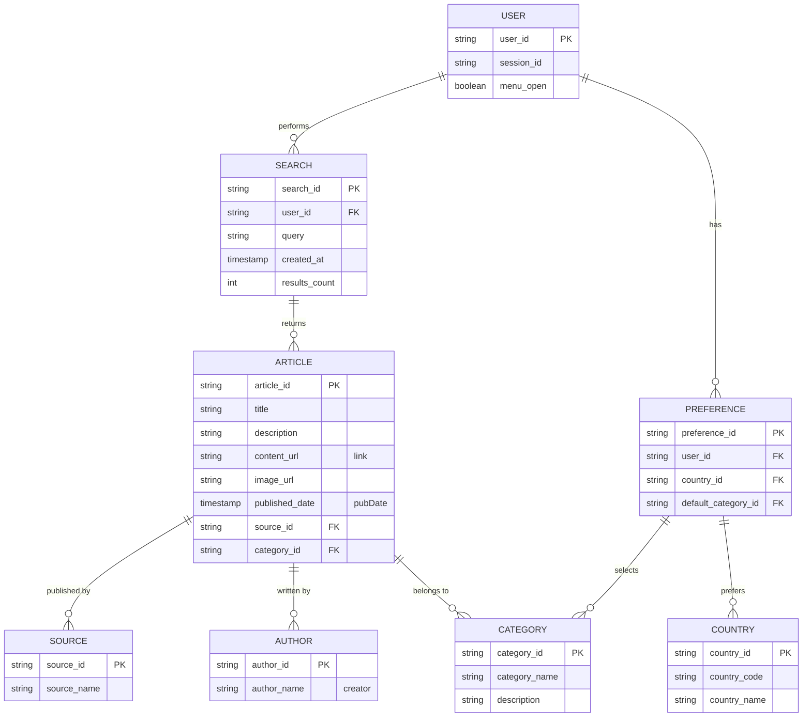

# NewsMonkey ER Diagram

## Data Model Overview



## Entity Details

### 1. **USER**
| Field | Type | Constraint |
|-------|------|-----------|
| user_id | UUID | PRIMARY KEY |
| session_id | String | Session tracking |
| menu_open | Boolean | Mobile menu state |

### 2. **ARTICLE**
| Field | Type | Constraint |
|-------|------|-----------|
| article_id | UUID | PRIMARY KEY |
| title | String | NOT NULL |
| description | String | |
| content_url | URL | NOT NULL |
| image_url | URL | |
| published_date | DateTime | NOT NULL |
| source_id | FK | REFERENCES SOURCE |
| category_id | FK | REFERENCES CATEGORY |

### 3. **SOURCE**
| Field | Type | Constraint |
|-------|------|-----------|
| source_id | UUID | PRIMARY KEY |
| source_name | String | UNIQUE, NOT NULL |

### 4. **CATEGORY**
| Field | Type | Constraint |
|-------|------|-----------|
| category_id | String | PRIMARY KEY |
| category_name | String | UNIQUE, NOT NULL |

**Categories:** breaking, business, crime, domestic, education, entertainment, environment, food, health, lifestyle, other, politics, science, sports, technology, top, tourism, world

### 5. **AUTHOR**
| Field | Type | Constraint |
|-------|------|-----------|
| author_id | UUID | PRIMARY KEY |
| author_name | String | |

### 6. **COUNTRY**
| Field | Type | Constraint |
|-------|------|-----------|
| country_id | String | PRIMARY KEY |
| country_code | String (2) | e.g., "in", "us" |
| country_name | String | |

### 7. **SEARCH**
| Field | Type | Constraint |
|-------|------|-----------|
| search_id | UUID | PRIMARY KEY |
| user_id | FK | REFERENCES USER |
| query | String | NOT NULL |
| created_at | DateTime | NOT NULL |
| results_count | Int | |

### 8. **PREFERENCE**
| Field | Type | Constraint |
|-------|------|-----------|
| preference_id | UUID | PRIMARY KEY |
| user_id | FK | REFERENCES USER |
| country_id | FK | REFERENCES COUNTRY |
| default_category_id | FK | REFERENCES CATEGORY |

## Current React Context State

```
NewsContext {
  query: string               // Current search query
  setQuery: function
  country: string             // User's country (default: "in")
  setCountry: function
  search: string              // Search input value
  setSearch: function
  menuOpen: boolean           // Mobile menu state
  setMenuOpen: function
  category: string            // Selected category (default: "general")
  setCategory: function
}
```

## API Integration Points

### NewsData.io API
- **Endpoint:** `https://newsdata.io/api/1/news`
- **Query Parameters:**
  - `apikey`: API Key
  - `country`: Country code (e.g., "in")
  - `language`: "en"
  - `q`: Search query (optional)
  - `category`: Category (optional, if not searching)

### Response Object
```json
{
  "results": [
    {
      "title": "Article Title",
      "description": "Description",
      "image_url": "URL",
      "link": "Article URL",
      "creator": ["Author Name"],
      "pubDate": "2026-03-26 12:00:00",
      "source_name": "Source Name"
    }
  ]
}
```

## Relationships Summary

1. **USER → SEARCH** (1:M)
   - One user can perform multiple searches

2. **SEARCH → ARTICLE** (1:M)
   - One search returns multiple articles

3. **USER → PREFERENCE** (1:1)
   - Each user has one preference record

4. **PREFERENCE → COUNTRY** (M:1)
   - Multiple users can prefer same country

5. **PREFERENCE → CATEGORY** (M:1)
   - Multiple users can prefer same category

6. **ARTICLE → SOURCE** (M:1)
   - Multiple articles from same source

7. **ARTICLE → AUTHOR** (M:1)
   - Multiple articles by same author

8. **ARTICLE → CATEGORY** (M:1)
   - Multiple articles in same category
