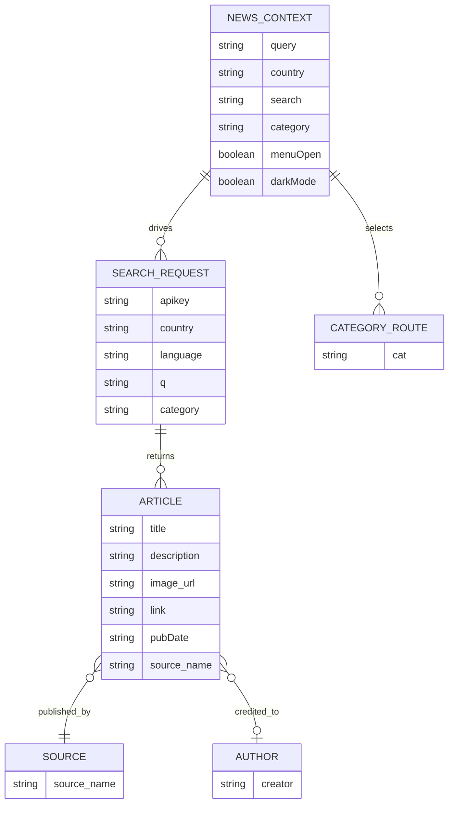

# NewsLens Data Model

This project does not currently have a relational database. The useful "ER" view for the app is the runtime data model made up of React context state, route params, and the NewsData.io response payload.

## Runtime Entity Diagram



## Entity Definitions

### `NEWS_CONTEXT`

Shared client-side state provided by `ContextProvider`.

| Field | Type | Description |
|---|---|---|
| `query` | string | Active search query used by the news feed |
| `country` | string | Country code sent to the API, default `in` |
| `search` | string | Controlled value of the navbar search input |
| `category` | string | Active category, default `general` |
| `menuOpen` | boolean | Mobile navigation visibility |
| `darkMode` | boolean | Theme mode persisted in `localStorage` |

### `CATEGORY_ROUTE`

Route parameter from `/category/:cat`.

| Field | Type | Description |
|---|---|---|
| `cat` | string | Category slug selected from the navbar |

### `SEARCH_REQUEST`

Computed request object produced inside `News.jsx`.

| Field | Type | Required | Notes |
|---|---|---|---|
| `apikey` | string | Yes | Read from `VITE_NEWS_API_KEY` |
| `country` | string | Yes | Comes from context or prop override |
| `language` | string | Yes | Hard-coded to `en` |
| `q` | string | No | Added only when a search query exists |
| `category` | string | No | Added only when category is not `general` and query is empty |

### `ARTICLE`

Primary content item returned by NewsData.io and rendered by `NewsItem`.

| Field | Type | Description |
|---|---|---|
| `title` | string | Headline text |
| `description` | string | Short summary |
| `image_url` | string | Thumbnail or hero image URL |
| `link` | string | External article URL |
| `pubDate` | string | Publication date string |
| `source_name` | string | Publisher name |
| `creator` | string[] | Optional author array from the API |

### `SOURCE`

Publisher metadata embedded inside each article response.

| Field | Type | Description |
|---|---|---|
| `source_name` | string | Human-readable publication name |

### `AUTHOR`

Optional author metadata derived from `creator`.

| Field | Type | Description |
|---|---|---|
| `creator` | string | First author shown in the UI when available |

## API Response Shape

Example payload used by the app:

```json
{
  "results": [
    {
      "title": "Article Title",
      "description": "Description",
      "image_url": "https://example.com/image.jpg",
      "link": "https://example.com/story",
      "creator": ["Author Name"],
      "pubDate": "2026-03-26 12:00:00",
      "source_name": "Source Name"
    }
  ]
}
```

## Relationship Notes

1. One `NEWS_CONTEXT` state can produce many `SEARCH_REQUEST` combinations over time.
2. One `CATEGORY_ROUTE` value updates the `category` field in `NEWS_CONTEXT`.
3. One `SEARCH_REQUEST` returns zero or more `ARTICLE` records.
4. Each `ARTICLE` is displayed with one visible `SOURCE`.
5. Each `ARTICLE` may expose zero or more authors, but the UI currently displays only the first creator.

## Supported Categories

The navbar currently exposes these category slugs:

`breaking`, `business`, `crime`, `domestic`, `education`, `entertainment`, `environment`, `food`, `health`, `lifestyle`, `other`, `politics`, `science`, `sports`, `technology`, `top`, `tourism`, `world`

## Important Clarification

- There is no persisted `USER`, `SEARCH`, or `PREFERENCE` table in the current codebase.
- User preferences exist only in browser memory, except for `darkMode`, which is stored in `localStorage`.
- If a backend is added later, this file should be split into a true database ERD and a separate client-side state model.
